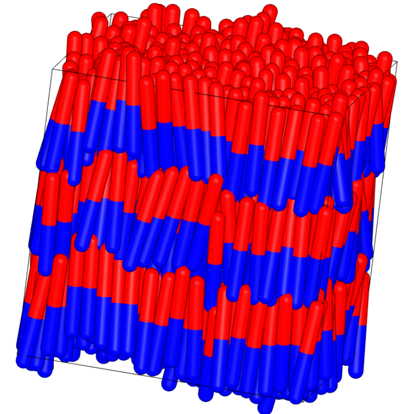
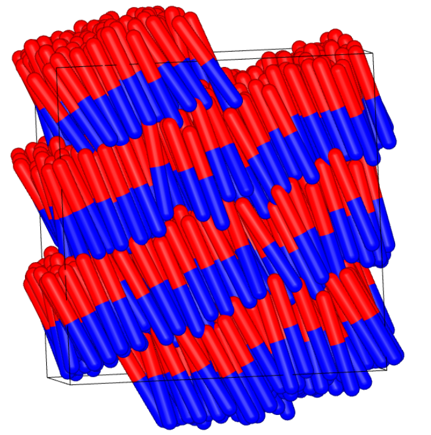
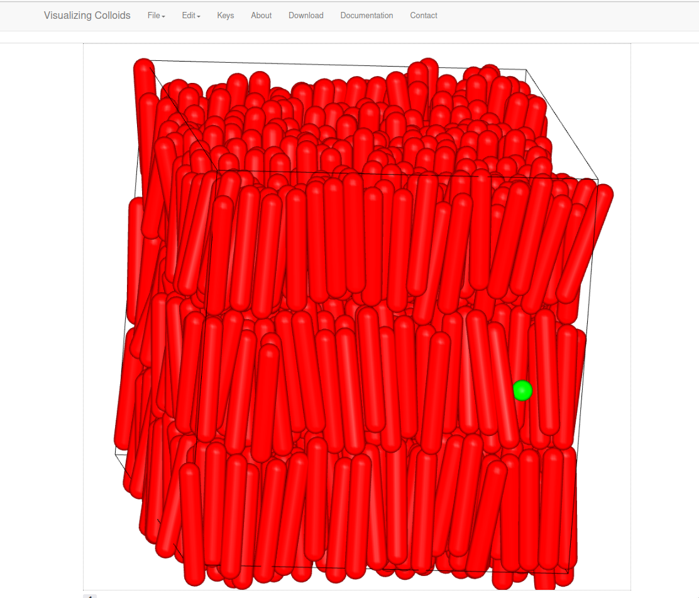

# Monte-Carlo-Algorithm-Spherocylinders
Fortran Code: Monte Carlo Algorithm Spherocylinders

# Preview
<p align="center">
  
</p>

<p align="center">
  
</p>

<p align="center">
  
</p>


# Dynamic Monte Carlo (DMC) / MC NVT simulations with dipolar rods (Fortran 77)

This repository contains the Fortran code developed during my PhD to run Monte Carlo simulations (NVT/NPT) of spherocylindrical rod-like particles including dipolar interactions (reaction-field / long-range handling implemented in the code).

The main program is `MCNPTV06` and it reads parameters from an input file (`.inp`). The code also uses an include file (`.inc`) defining COMMON blocks and simulation parameters.

## Repository structure

- `src/`  
  - `mcnptv06.for` : main program and subroutines  
  - `mcnptv06.inc` : COMMON blocks / parameters (included by the main code)
- `inputs/`  
  - `mcnptv06.inp` : example input parameters
- `results/figures/`  
  - snapshots / OVITO renders / GIFs used for visualization

## Requirements

- Fortran compiler supporting Fortran 77 fixed-form (recommended: **gfortran**)

## Compile

From the repo root:

```bash
gfortran -std=legacy -ffixed-line-length-none -O2 -o mcnptv06 src/mcnptv06.for
